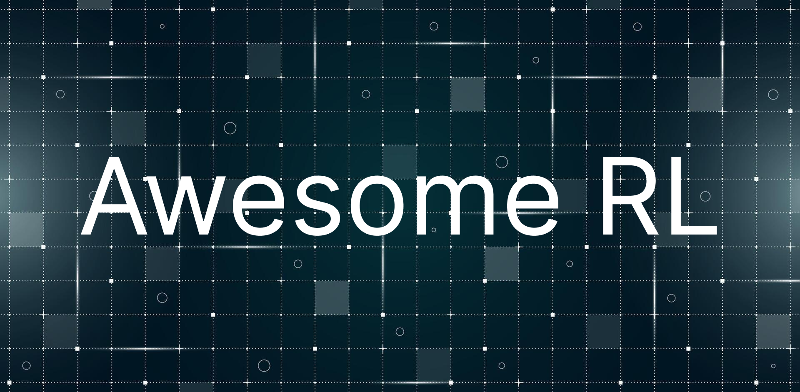

<!-- <h1 align="center">Awesome RL</h1> -->

  

  A collection of publications, resources, and tools related to Reinforcement Learning (RL).

  <a href="#publications"><strong>Publications</strong></a> ·
  <a href="#books"><strong>Books</strong></a> ·
  <a href="#courses"><strong>Courses</strong></a> ·
  <a href="#code"><strong>Code</strong></a>
  <!-- <a href="#news"><strong>News</strong></a> -->

 

## Publications

**Generalists**

- [Emergent Tool Use From Multi-Agent Autocurricula](https://arxiv.org/abs/1909.07528)
- [Generally capable agents emerge from open-ended play](https://arxiv.org/abs/2107.12808)
- [GATO: A Generalist Agent](https://arxiv.org/abs/2205.06175)
- [RoboCat: A Self-Improving Generalist Agent for Robotic Manipulation](https://arxiv.org/abs/2306.11706)
- [RT-2: Vision-Language-Action Models Transfer Web Knowledge to Robotic Control](https://arxiv.org/abs/2307.15818)
- [SIMA: Scaling Instructable Agents Across Many Simulated Worlds](https://arxiv.org/abs/2404.10179)

**LLMs**

- [DeepSeekMath: Pushing the Limits of Mathematical Reasoning in Open Language Models](https://arxiv.org/abs/2402.03300)
- [DeepSeek-R1: Incentivizing Reasoning Capability in LLMs via Reinforcement Learning](https://arxiv.org/abs/2501.12948)
- [s1: Simple test-time scaling](https://arxiv.org/abs/2501.19393v1)

**Games**

- [AlphaGo: Mastering the game of Go with deep neural networks and tree search](https://storage.googleapis.com/deepmind-media/DeepMind.com/AlphaGo/AlphaGoNaturePaper.pdf)
- [AlphaGo Zero: Mastering the game of Go without human knowledge](https://www.nature.com/articles/nature24270.epdf?author_access_token=VJXbVjaSHxFoctQQ4p2k4tRgN0jAjWel9jnR3ZoTv0PVW4gB86EEpGqTRDtpIz-2rmo8-KG06gqVobU5NSCFeHILHcVFUeMsbvwS-lxjqQGg98faovwjxeTUgZAUMnRQ)
- [AlphaZero: Shedding new light on chess, shogi, and Go](https://storage.googleapis.com/deepmind-media/DeepMind.com/Blog/alphazero-shedding-new-light-on-chess-shogi-and-go/alphazero_preprint.pdf)
- [AlphaStar: Grandmaster level in StarCraft II using multi-agent reinforcement learning](https://www.nature.com/articles/s41586-019-1724-z.epdf?author_access_token=lZH3nqPYtWJXfDA10W0CNNRgN0jAjWel9jnR3ZoTv0PSZcPzJFGNAZhOlk4deBCKzKm70KfinloafEF1bCCXL6IIHHgKaDkaTkBcTEv7aT-wqDoG1VeO9-wO3GEoAMF9bAOt7mJ0RWQnRVMbyfgH9A%3D%3D)
- [OpenSpiel: A Framework for Reinforcement Learning in Games](https://arxiv.org/abs/1908.09453)
- [OpenAI Five: Dota 2 with Large Scale Deep Reinforcement Learning](https://arxiv.org/abs/1912.06680)
- [MuZero: Mastering Atari, Go, chess and shogi by planning with a learned model](https://www.nature.com/articles/s41586-020-03051-4.epdf?sharing_token=kTk-xTZpQOF8Ym8nTQK6EdRgN0jAjWel9jnR3ZoTv0PMSWGj38iNIyNOw_ooNp2BvzZ4nIcedo7GEXD7UmLqb0M_V_fop31mMY9VBBLNmGbm0K9jETKkZnJ9SgJ8Rwhp3ySvLuTcUr888puIYbngQ0fiMf45ZGDAQ7fUI66-u7Y%3D)
- [AlphaDev: Faster sorting algorithms discovered using deep reinforcement learning](https://www.nature.com/articles/s41586-023-06004-9)

**Robotics**

**Finance**

## Books

- [Reinforcement Learning: An Introduction (2nd Edition)](http://incompleteideas.net/book/the-book-2nd.html) by Richard S. Sutton and Andrew G. Barto
- [Reinforcement Learning: State-of-the-Art](https://link.springer.com/book/10.1007/978-3-642-27645-3) by Marco Wiering and Martijn van Otter
- [Artificial Intelligence: A Modern Approach (4th Edition)](http://aima.cs.berkeley.edu/) by Stuart Russell and Peter Norvig
- [Deep Learning](https://www.deeplearningbook.org/) by Ian Goodfellow, Yoshua Bengio, and Aaron Courville
- [Deep Reinforcement Learning Hands-On](https://github.com/PacktPublishing/Deep-Reinforcement-Learning-Hands-On) by Maxim Lapan

## Courses

**Online Courses**

- [Deep Reinforcement Learning Course](https://huggingface.co/learn/deep-rl-course/en/unit0/introduction) by Hugging Face

**Lectures**

- [David Silver's Reinforcement Learning Course](https://www.davidsilver.uk/teaching/) at University College London
- [CS234: Reinforcement Learning, Winter 2025](https://web.stanford.edu/class/cs234/index.html) at Stanford University
- [CS285: Deep Reinforcement Learning](https://sites.google.com/view/berkeley-cs285/) at UC Berkeley
- [CS330: Deep Multi-Task and Meta Learning](https://cs330.stanford.edu/) at Stanford University

**Blogs**

- [Deep Reinforcement Learning: Pong from Pixels](https://karpathy.github.io/2016/05/31/rl/) by Andrej Karpathy
- [Train a Mario-playing RL Agent](https://pytorch.org/tutorials/intermediate/mario_rl_tutorial.html) from PyTorch
- [Reinforcement Learning (PPO) with TorchRL](https://pytorch.org/tutorials/intermediate/reinforcement_ppo.html) from PyTorch

## Code

**ML-Libraries**

- [PyTorch](https://pytorch.org/) - Most popular deep learning framework.
- [TorchRL](https://pytorch.org/rl/stable/index.html) - Official reinforcement learning library for PyTorch.
- [TRL - Transformer Reinforcement Learning](https://huggingface.co/docs/trl/en/index) - A library by Hugging Face to train transformer language models with Reinforcement Learning.
- [DI-engine](https://github.com/opendilab/DI-engine) - A decision intelligence engine for PyTorch and JAX with implementations of various RL algorithms and environments.
- [Stable Baselines3](https://stable-baselines3.readthedocs.io/en/master/) - A set of reliable implementations of RL algorithms in PyTorch.
- [CleanRL](https://github.com/vwxyzjn/cleanrl) - A collection of high-quality implementations of RL algorithms in PyTorch.
- [RLlib](https://docs.ray.io/en/latest/rllib/index.html) - A reinforcement learning library built for high scalability on Ray. (Not recommended for small-scale projects)

**Gyms**

- [Gymnasium](https://gymnasium.farama.org/) - General-purpose interface for interacting with custom RL environments.
- [Gymnasium-Robotics](https://github.com/Farama-Foundation/Gymnasium-Robotics) - A collection of robotics environments for Gymnasium running on Mujoco.
- [Gazebo](http://gazebosim.org/) - A tool for building custom 3D robotics simulations.
- [pyBullet](https://pybullet.org/wordpress/) - A Python module for physics simulation for robotics.
- [Nvidia Isaac Lab](https://developer.nvidia.com/isaac/lab) - A framework for creating GPU optimized 3D robotics simulations with Isaac Sim.
- [MuJoCo](https://mujoco.org/) - A physics engine for robotics and biomechanics.
- [Unity ML-Agents](https://github.com/Unity-Technologies/ml-agents) - Enables Unity games and simulations to be used as environments for RL.
- [Unreal Learning Agents](https://dev.epicgames.com/community/learning/tutorials/8OWY/unreal-engine-learning-agents-introduction) - A plugin for Unreal Engine that allows you to train RL agents in Unreal Engine environments.
- [PettingZoo](https://github.com/Farama-Foundation/PettingZoo) - A library for multi-agent reinforcement learning environments.
- [OpenSpiel](https://github.com/google-deepmind/open_spiel) - A collection of environments and algorithms for research in general reinforcement learning and search/planning in games.
- [FinRL-Meta](https://github.com/AI4Finance-Foundation/FinRL-Meta) - A Metaverse of Market Environments and Benchmarks for Data-Driven Financial Reinforcement Learning.
- [Luanti (formerly Minetest)](https://www.luanti.org/) - An open-source voxel game engine (similar to Minecraft) that can be used for RL research.
- [XLandMinigrid](https://github.com/dunnolab/xland-minigrid) - A suite of tools, grid-world environments, and benchmarks for meta-reinforcement learning research inspired by the diversity and depth of XLand and the simplicity and minimalism of MiniGrid.
- [MuJoCo-Worldgen](https://github.com/openai/mujoco-worldgen) - A library for generating diverse and complex environments for RL research. (Unmaintained)
- [Multi-Agent-Emergence-Environments](https://github.com/openai/multi-agent-emergence-environments) - A collection of environments for studying the emergence of communication and cooperation in multi-agent systems. (Unmaintained)
- [procgen](https://github.com/openai/procgen) - A suite of 16 reinforcement learning environments with procedurally generated levels, designed to benchmark generalization in RL agents. (Unmaintained)
- [jumanji](https://github.com/instadeepai/jumanji) - A suite of 22 high-performance reinforcement learning environments written in JAX.
- [SMAC](https://github.com/oxwhirl/smac) - A StarCraft II multi-agent reinforcement learning environment.
- [gfootball](https://github.com/google-research/football) - A 3D soccer reinforcement learning environment based on the game "Gameplay Football" by the Google Brain team.

<!-- ## News

Most of these sources are not specific to reinforcement learning but cover a wide range of AI topics, including RL.

**X Accounts**

- [@giffmana](https://x.com/giffmana) - Lucas Beyer, a researcher at OpenAI, formerly DeepMind and Google Brain.
- [@deepseek_ai](https://x.com/deepseek_ai) - DeepSeek, a research group focused on LLM foundation models.
- [@GoogleDeepMind](https://twitter.com/GoogleDeepMind) - DeepMind's official Twitter account.
- [@OpenAI](https://twitter.com/OpenAI) - OpenAI's official Twitter account.

**Podcasts** -->
